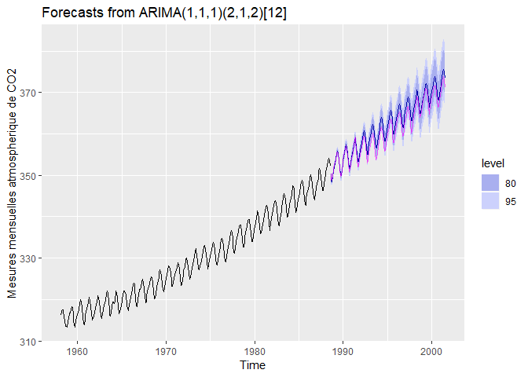

series temporelles
================
Yonel PETIT-HOMME
2019-04-04

Introduction
============

Une série temporelle (ou une série chronologique) est définit comme des données liées au temps. Cet indice temps peut être de différent ordre de grandeur comme la seconde, la minute, l'heure, le jour, l'année etc..[Notes de cours GAA-7007, 2019](https://essicolo.github.io/ecologie-mathematique-R/chapitre-git.html).

Ces données peuvent être de différents types par exemple: des données météorologiques, de recencesement de population, des données sur la vente d'un produit quelconque dans une entreprise etc.

Parfois pour des raisons économiques ou autres, l'analyse de ces données ainsi que des prévisions se revèlent souvent très importantes car elles servent généralement à prendre des décisions pour le futur.

Ainsi, ce présent travail s'inscrit dans un objectif d'apprentissage de la manipulation des données chronologiques. Il consiste principalement à créer une série temporelle, effectuer une modélisation et projeter la prévision pour effectuer des analyses sur la perfomance d'un modèle et de la prévision.

Analyses des données
====================

présntation des données
-----------------------

Les données utilisées dans ce travail représentent les moyennes des mesures mensuelles de CO2 atmosphérique en ppm-volume collectées au Mauna Loa Observatory à Hawaii de mars 1958 à juillet 2001, inclusivement.

Chargement de package
---------------------

``` r
library(tidyverse)
```

    ## -- Attaching packages ------------------------------------------------------------------------- tidyverse 1.2.1 --

    ## v ggplot2 3.1.0       v purrr   0.3.2  
    ## v tibble  2.1.1       v dplyr   0.8.0.1
    ## v tidyr   0.8.3       v stringr 1.4.0  
    ## v readr   1.3.1       v forcats 0.4.0

    ## -- Conflicts ---------------------------------------------------------------------------- tidyverse_conflicts() --
    ## x dplyr::filter() masks stats::filter()
    ## x dplyr::lag()    masks stats::lag()

``` r
library(lubridate)
```

    ## 
    ## Attaching package: 'lubridate'

    ## The following object is masked from 'package:base':
    ## 
    ##     date

``` r
library("forecast")
```

### Importation des données

``` r
hawai_import <- read.csv("hawai.csv", encoding = "UTF-8")
```

### Création d'une nouvelle variable `Date` et exportation de du jeu données

``` r
hawai_import <- hawai_import %>%
  mutate(Date = date_decimal(hawai_import$time))
```

``` r
write.csv(hawai_import, "hawai_import.csv")
```

La fonction `date_decimal` du package `lubridate` permet de transformer les décimaux en date, format "POSIXct".

**Voyons la structure du jeu de données**

``` r
str(hawai_import)
```

    ## 'data.frame':    526 obs. of  3 variables:
    ##  $ time: num  1958 1958 1958 1959 1958 ...
    ##  $ CO2 : num  316 317 317 317 316 ...
    ##  $ Date: POSIXct, format: "1958-03-02 20:00:01" "1958-04-02 06:00:00" ...

``` r
any(is.na(hawai_import)) # pas de valeurs manquantes
```

    ## [1] FALSE

### Visualisation des mesures mensuelles de CO2 atmosphérique

``` r
ggplot(data = hawai_import, mapping = aes(x = Date, y = CO2)) +
  geom_line() + 
  ylab("mesures mensuelles de CO2 atmosphérique") 
```


On observe une augmentation de CO2 dans le temps, avec des cycles visiblement réguliers.

1- Création de séries temporelles du CO2 à partir du jeu de données hawai\_import
=================================================================================

Nous allons utiliser la fonction `ts` du package de base en R

``` r
hawai_import_ts <- ts(hawai_import %>% select(-c(Date, time)),
                    start = c(hawai_import$Date[1] %>% year(), 3),
                    frequency = 12)
```

**Jeu de données de mars 1958 à juillet 2001 comme mentionné dans le libellé**

``` r
hawai_import_ts <- window(hawai_import_ts, start= c(1958, 3), end = c(2001, 7))
length(hawai_import_ts)
```

    ## [1] 521

``` r
inherits(hawai_import_ts, "ts")# format Times-Series 
```

    ## [1] TRUE

Avec la fonction `inherits`, on vérifie la classe de l'objet hawai\_import\_ts

**Essayons de filtrer les 10 premières années de la série temporelle avec la fonction `window`et visualisation avec la fonction `autoplot`**.

``` r
hawai_import_ts_10 <- window(hawai_import_ts, start= c(1958, 3), end = c(1968, 3))
autoplot(hawai_import_ts_10)
```


Cette figure c'est juste pour une visualisation plus claire.

-**Extraction de 10 premiers éléments de la série correspondant à l'année 1958**

``` r
head(hawai_import_ts_10, 10) 
```

    ##           Mar      Apr      May      Jun      Jul      Aug      Sep
    ## 1958 316.1000 317.2000 317.4333 317.4333 315.6250 314.9500 313.5000
    ##           Oct      Nov      Dec
    ## 1958 313.5000 313.4250 314.7000

Visualisation entière de la séries avec `autoplot`
--------------------------------------------------

``` r
autoplot(hawai_import_ts)
```


visualisation sur un graphique polaire des premières annnées de la série
------------------------------------------------------------------------

``` r
ggP <- ggseasonplot(hawai_import_ts_10, polar = TRUE) + ggtitle("")
ggP
```


On voit très bien sur la graphique ci-dessus que la concentration de CO2 Augmente au fil du temps.

Chaque cycle correspond à une année et les couleurs sont aussi differentes

2- Sépation de la série en partie d'entrainement (environ 70% des données) et en parties test
=============================================================================================

``` r
n <- length(hawai_import_ts)
n     # nombre total d'observation
```

    ## [1] 521

``` r
ntrain <- n*0.7
ntrain    # nombre d'observation des données test
```

    ## [1] 364.7

``` r
hawai_import$Date[ntrain] %>% year()  # l'année qui termine la serie d'entrainement
```

    ## [1] 1988

``` r
hawai_import$Date[ntrain] %>% year() 
```

    ## [1] 1988

``` r
hawai_import_ts_train <- window(hawai_import_ts, start= c(1958, 3), end = c(1988, 7))
hawai_import_ts_train # 70% environ des donnees
```

    ##           Jan      Feb      Mar      Apr      May      Jun      Jul
    ## 1958                   316.1000 317.2000 317.4333 317.4333 315.6250
    ## 1959 315.5000 316.7000 316.7333 317.6750 318.3250 318.0250 316.5250
    ## 1960 316.3800 316.9750 317.5750 319.1200 319.9250 319.4500 318.0600
    ## 1961 316.9250 317.6500 318.5250 319.4200 320.4750 319.7500 318.3200
    ## 1962 317.9250 318.6250 319.6800 320.5500 320.9000 320.5000 319.4250
    ## 1963 318.7250 318.9667 319.8600 321.2750 322.1000 321.4600 319.6000
    ## 1964 319.4000 319.4000 319.1000 319.4000 322.0000 321.7500 320.3000
    ## 1965 319.4000 320.4500 320.9250 322.0000 322.0600 321.7750 321.0400
    ## 1966 320.5400 321.5750 322.3750 323.6600 324.0250 323.7000 322.8500
    ## 1967 322.4000 322.4250 323.0000 324.2800 324.9500 324.0750 322.4800
    ## 1968 322.5500 323.0500 323.9200 324.9750 325.4750 325.2600 324.0250
    ## 1969 323.9250 324.2750 325.6000 326.5750 327.2800 326.5500 325.8000
    ## 1970 325.0800 326.0250 327.0000 328.0750 327.9200 327.5500 326.3000
    ## 1971 326.1400 326.6500 327.2000 327.6750 328.8200 328.4750 327.2200
    ## 1972 326.7200 327.6250 327.7250 329.6400 330.0000 329.0750 328.0400
    ## 1973 328.5500 329.4750 330.3800 331.5750 332.4000 331.9400 330.6500
    ## 1974 329.3250 330.6250 331.5000 332.6250 332.9750 332.1600 331.0750
    ## 1975 330.2500 331.3000 332.0000 333.2750 333.8600 333.4000 331.8000
    ## 1976 331.7400 332.5500 333.4500 334.4500 334.7600 334.4000 332.8600
    ## 1977 332.8800 333.4250 334.7000 336.0400 336.6750 336.2000 334.8000
    ## 1978 335.0250 335.3500 336.6000 337.6400 337.9500 337.9250 336.5000
    ## 1979 336.2250 336.7000 338.0000 338.8750 339.3750 339.2400 337.5250
    ## 1980 337.9250 338.2250 340.0600 340.7500 341.3400 340.9500 339.3750
    ## 1981 339.2200 340.4500 341.4000 342.4500 342.8200 342.1250 340.4250
    ## 1982 340.7000 341.5500 342.6750 343.4750 343.9600 343.3000 341.9200
    ## 1983 341.3400 342.5000 343.1500 344.9000 345.6500 345.2750 343.8200
    ## 1984 343.6750 344.4250 345.1750 347.4000 347.3500 346.6600 345.2000
    ## 1985 344.9250 345.8750 347.4400 348.3250 348.8250 348.1800 346.4500
    ## 1986 346.2500 346.8250 347.7400 349.5250 350.0800 349.3750 347.8250
    ## 1987 348.0000 348.5000 349.4750 350.8500 351.7400 351.1500 349.4500
    ## 1988 350.4000 351.7750 352.1250 353.5800 354.1750 353.7500 352.2200
    ##           Aug      Sep      Oct      Nov      Dec
    ## 1958 314.9500 313.5000 313.5000 313.4250 314.7000
    ## 1959 314.9000 313.8250 313.4000 314.8750 315.5250
    ## 1960 315.7750 314.1750 313.8400 315.0250 316.2000
    ## 1961 316.7750 315.0400 315.3500 316.0500 316.9800
    ## 1962 317.7333 316.0667 315.4750 316.5500 317.5250
    ## 1963 317.6000 316.1500 316.0500 317.0000 318.3500
    ## 1964 318.5000 316.6000 316.9600 317.7250 318.6750
    ## 1965 318.7250 317.8250 317.3400 318.8750 319.3250
    ## 1966 320.2000 318.7000 318.1800 319.9000 321.0600
    ## 1967 320.8500 319.3000 319.4500 320.6750 321.9200
    ## 1968 321.9400 320.2500 320.2750 321.3200 322.9250
    ## 1969 323.5400 322.4000 321.8000 322.8200 324.1250
    ## 1970 324.6600 323.1500 323.1400 324.0500 325.1000
    ## 1971 325.2500 323.4000 323.5400 324.8250 325.9250
    ## 1972 326.2500 324.8600 325.3000 326.4250 327.5400
    ## 1973 329.3250 327.5000 327.2250 328.0500 328.6400
    ## 1974 329.2200 327.3750 327.3750 328.4000 329.6750
    ## 1975 329.9800 328.5250 328.3250 329.4400 330.7750
    ## 1976 330.7250 329.3500 329.1000 330.3500 331.6250
    ## 1977 332.8750 331.5750 331.2000 332.3500 333.8600
    ## 1978 334.6500 332.7400 332.6500 333.8250 334.9600
    ## 1979 336.0250 333.9800 333.9500 335.1500 336.6600
    ## 1980 337.6000 335.8750 336.0250 337.0600 338.2000
    ## 1981 338.4000 336.7000 336.9400 338.4250 339.6000
    ## 1982 339.6250 338.0250 337.9000 339.2750 340.4250
    ## 1983 342.1500 339.8750 340.0200 341.1500 342.9800
    ## 1984 343.3000 341.1200 341.4750 342.8500 344.1400
    ## 1985 344.3000 343.0000 342.8000 344.2200 345.5750
    ## 1986 345.8200 344.8000 344.1000 345.6200 346.8750
    ## 1987 348.0800 346.4000 346.4400 347.9250 348.9250
    ## 1988

``` r
length(hawai_import_ts_train) 
```

    ## [1] 365

``` r
hawai_import_ts_test <- window(hawai_import_ts, start= c(1988, 8))
hawai_import_ts_test  # 30% des donnees
```

    ##          Jan     Feb     Mar     Apr     May     Jun     Jul     Aug
    ## 1988                                                         350.300
    ## 1989 352.775 353.000 353.600 355.360 355.600 355.125 353.860 351.575
    ## 1990 353.650 354.650 355.480 356.175 357.075 356.080 354.675 352.900
    ## 1991 354.675 355.650 357.200 358.600 359.250 358.180 356.050 353.860
    ## 1992 355.900 356.680 357.900 359.075 359.540 359.125 357.000 354.860
    ## 1993 356.680 357.175 358.425 359.325 360.180 359.500 357.420 355.325
    ## 1994 358.320 358.900 359.925 361.220 361.650 360.900 359.460 357.375
    ## 1995 359.975 360.925 361.575 363.360 363.700 363.250 361.800 359.375
    ## 1996 362.025 363.175 364.060 364.700 365.325 364.880 363.475 361.320
    ## 1997 363.125 363.875 364.560 366.325 366.680 365.475 364.375 362.460
    ## 1998 365.340 366.200 367.375 368.525 369.140 368.750 367.600 365.720
    ## 1999 368.120 368.850 369.600 370.975 370.840 370.250 369.000 366.700
    ## 2000 369.020 369.375 370.400 371.540 371.650 371.625 369.940 367.950
    ## 2001 370.175 371.325 372.060 372.775 373.800 373.060 371.300        
    ##          Sep     Oct     Nov     Dec
    ## 1988 348.750 348.960 350.000 351.360
    ## 1989 349.860 350.050 351.200 352.480
    ## 1990 350.940 351.225 352.700 354.140
    ## 1991 352.125 352.250 353.740 355.025
    ## 1992 353.025 353.420 354.200 355.350
    ## 1993 353.775 354.060 355.350 356.775
    ## 1994 355.925 356.020 357.575 359.060
    ## 1995 358.000 357.850 359.475 360.700
    ## 1996 359.400 359.625 360.740 362.375
    ## 1997 360.150 360.750 362.380 364.250
    ## 1998 363.925 364.320 365.550 366.925
    ## 1999 364.675 365.140 366.650 367.900
    ## 2000 366.540 366.725 368.125 369.440
    ## 2001

``` r
length(hawai_import_ts_test) 
```

    ## [1] 156

**Petite vérification**

``` r
(length(hawai_import_ts_test) + length(hawai_import_ts_train)) == length(hawai_import_ts)
```

    ## [1] TRUE

Donc la série a bien été séparée en partie d'entrainement et en partie test

3- Création d'un modèle `ETS` sur les données d'entrainement, puis projection de la prévision de CO2 atmosphérique pour comparer aux données test
=================================================================================================================================================

Le modèle `ETS`
---------------

``` r
hawai_import_ets <- hawai_import_ts_train %>%
  forecast::ets()

hawai_import_ets
```

    ## ETS(M,Ad,M) 
    ## 
    ## Call:
    ##  forecast::ets(y = .) 
    ## 
    ##   Smoothing parameters:
    ##     alpha = 0.6729 
    ##     beta  = 0.028 
    ##     gamma = 1e-04 
    ##     phi   = 0.9763 
    ## 
    ##   Initial states:
    ##     l = 314.7929 
    ##     b = 0.0897 
    ##     s = 1.0017 0.9997 0.9971 0.9939 0.9909 0.9914
    ##            0.9965 1.0024 1.0068 1.0086 1.0071 1.0039
    ## 
    ##   sigma:  0.001
    ## 
    ##      AIC     AICc      BIC 
    ## 1384.499 1386.476 1454.697

On obtient un modèle de type ETS(M,Ad,M), c'est-à-dire d'erreur de type multiplicative (M), de tendance additive adoucissante (Ad) et de saison de type multiplicative (M).

La valeur de phi = 0.9763 nous indique sur l'importance de l'adoucissement (une faible adoucissement)

C'est un modèle non stationnaire c'est-à-dire avec présence de tendance et saisonnalité

Visualisation de l'évolution des différentes composantes du modèle
------------------------------------------------------------------

``` r
hawai_import_ets %>% autoplot()
```


**Présentons un sommaire plus detaillé des résultats du modèle**

``` r
summary(hawai_import_ets)
```

    ## ETS(M,Ad,M) 
    ## 
    ## Call:
    ##  forecast::ets(y = .) 
    ## 
    ##   Smoothing parameters:
    ##     alpha = 0.6729 
    ##     beta  = 0.028 
    ##     gamma = 1e-04 
    ##     phi   = 0.9763 
    ## 
    ##   Initial states:
    ##     l = 314.7929 
    ##     b = 0.0897 
    ##     s = 1.0017 0.9997 0.9971 0.9939 0.9909 0.9914
    ##            0.9965 1.0024 1.0068 1.0086 1.0071 1.0039
    ## 
    ##   sigma:  0.001
    ## 
    ##      AIC     AICc      BIC 
    ## 1384.499 1386.476 1454.697 
    ## 
    ## Training set error measures:
    ##                      ME      RMSE       MAE        MPE       MAPE
    ## Training set 0.05620884 0.3295274 0.2495765 0.01676289 0.07583423
    ##                   MASE        ACF1
    ## Training set 0.2059554 0.002961553

On voit que le modèle présente un bon ajustement aux données d'entrainement avec surtout une valeur de MASE = 0.2059554, très proche de zéro. Par contre cela n'indique pas que le modèle prédira correctement.

Projection de la prévision avec la fonction `forecast`
------------------------------------------------------

``` r
hawai_import_prev <- hawai_import_ets %>% forecast(12*13)
hawai_import_prev %>% autoplot() +
  autolayer(hawai_import_ts_test, color = rgb(1, 0, 1, 0.6))+
  xlab("Time") +
  ylab("Mesures mensuelles atmospherique de CO2")
```


Le modèle parait être pas fiable car on observe une tendance de la baisse de CO2 sur le graphique contrairement à ce que nous montre les données test en rose.

4- Analyse de résidus du modèle ETS
===================================

``` r
checkresiduals(hawai_import_ets)
```


    ## 
    ##  Ljung-Box test
    ## 
    ## data:  Residuals from ETS(M,Ad,M)
    ## Q* = 45.262, df = 7, p-value = 1.216e-07
    ## 
    ## Model df: 17.   Total lags used: 24

Avec une valeur de p-value = 1.216e-07, il est peu probable que les résidus forment un bruit blanc.

Il semble qu'il y a une certaine corrélation dans les résidus en regardant le graphique d'autocorrélation, ce qui devrait être évité.

Aussi en regardant le graphique de la distribution des résidus, on remarque la présence de valeurs aberrantes et les données semblent ne pas distribuer normalement. Cela peut etre aussi verifier par un test de shapiro.

``` r
shapiro.test(residuals(hawai_import_ets)) # Ce test permet de voir la normalite ou non de la distribution des residus.
```

    ## 
    ##  Shapiro-Wilk normality test
    ## 
    ## data:  residuals(hawai_import_ets)
    ## W = 0.96812, p-value = 3.663e-07

Donc, on voit bien que la valeur de p-value = 3.663e-07 obtenue par ce test est très inférieure à 0.05. La distribution des résidus est non-normale.

**Evaluons l'exactitude de la prévision du modèle**

Faisons également l'analyse de l'exactitude du modèle sur la prévision avec la fonction forecast::accuracy() qui détecte de manière automatique la série d'entrainement de celle de test.

``` r
accuracy(hawai_import_prev, hawai_import_ts)
```

    ##                      ME      RMSE       MAE        MPE       MAPE
    ## Training set 0.05620884 0.3295274 0.2495765 0.01676289 0.07583423
    ## Test set     5.84659700 7.5812534 5.8465970 1.59965590 1.59965590
    ##                   MASE        ACF1 Theil's U
    ## Training set 0.2059554 0.002961553        NA
    ## Test set     4.8247256 0.982694962  5.907245

Le modèle semble ne se comporte pas bien suivant les valeurs des paramètres obtenues pour l'ensemble de test, surtout en se basant sur la valeur de **MASE = 4.8247256** très eloignée de zéro indiquant une mauvaise prévision du modèle.

Donc, un modèle présentant un bon ajustement aux données d'entrainement ne permet pas toujours de bonne prédiction.

C'est ce qu'on constate ici.

5- Les commentaires
===================

La plupart des commentaires sont insérrés après chaque partie du document, mais en ce qui a trait au modele `ets` on peut dire que ce modèle n'est pas fiable suivant les résultats de la prévision.

on pourrait améliorer le modèle en appliquant un autre méthode qui conviendrait le mieux comme ARIMA par exemple.

**Essayons la methode arima sur la série**

``` r
hawai_import_arima <- hawai_import_ts_train %>%
  auto.arima()


summary(hawai_import_arima) # sommaire
```

    ## Series: . 
    ## ARIMA(1,1,1)(2,1,2)[12] 
    ## 
    ## Coefficients:
    ##          ar1      ma1     sar1     sar2     sma1     sma2
    ##       0.3610  -0.7304  -0.2243  -0.1713  -0.6034  -0.1482
    ## s.e.  0.0979   0.0713   0.3211   0.0680   0.3234   0.2793
    ## 
    ## sigma^2 estimated as 0.1158:  log likelihood=-119.06
    ## AIC=252.12   AICc=252.45   BIC=279.17
    ## 
    ## Training set error measures:
    ##                      ME     RMSE       MAE        MPE       MAPE      MASE
    ## Training set 0.03093385 0.331369 0.2547369 0.00906678 0.07733826 0.2102138
    ##                     ACF1
    ## Training set -0.01388877

**Prévision avec le modèle ARIMA**

``` r
hawai_import_arima_prev <- hawai_import_arima %>% forecast(12*13)
hawai_import_arima_prev %>% autoplot() +
  autolayer(hawai_import_ts_test, color = rgb(1, 0, 1, 0.6))+
  xlab("Time") +
  ylab("Mesures mensuelles atmospherique de CO2")
```



**Analysons les résidus maintenant**

``` r
checkresiduals(hawai_import_arima)
```


    ## 
    ##  Ljung-Box test
    ## 
    ## data:  Residuals from ARIMA(1,1,1)(2,1,2)[12]
    ## Q* = 20.329, df = 18, p-value = 0.3146
    ## 
    ## Model df: 6.   Total lags used: 24

Maintenant, on obtient un meilleur modèle avec la méthode arima qui donne une valeur p-value = 0.3146. On peut dire que les résidus de ce modèle constituent un bruit blanc.

Donc cette méthode correspond mieux aux données.

On a pu constater aussi que le modèle `ARIMA(1,1,1)(2,1,2)[12]` détecte et fournit la composante saisonnière des données et la valeur \[12\] représente le nombre de saison.

**Maintenant, voyons l'exactitude de la prévision du modèle ARIMA**

``` r
accuracy(hawai_import_arima_prev, hawai_import_ts)
```

    ##                       ME     RMSE       MAE         MPE       MAPE
    ## Training set  0.03093385 0.331369 0.2547369  0.00906678 0.07733826
    ## Test set     -1.40303165 1.650990 1.4383602 -0.38758805 0.39759773
    ##                   MASE        ACF1 Theil's U
    ## Training set 0.2102138 -0.01388877        NA
    ## Test set     1.1869628  0.92421528  1.306094

L'analyse de l'exactitude de la prévision nous donne des valeurs de paramètres plus acceptables pour les données de test. On obtient maintenant une valeur de **MASE = 1.1869628** pour les données qui est meilleure maintenant comparativement à celle (MASE = 4.8247256) obtenue avec le modèle `ets`.

conclusion
==========

Dans ce travail, nous avons procecé à l'analyse d'une série temporelle, produire un modèle sur celle-ci et effecuer des commentires sur sa prévision. un modèle ets a été créé sur la série dont les résultats montrent sa non fiabilité à prédire sur les données de test. un modèle `arima` a été appliqué sur les données et les résultats se revèlent meilleurs que ceux de l'`ets`.

Donc, le modèle `ets` malgré son bon ajustement sur les données d'entrainement n'a pas permis une bonne prédiction.

Cela nous permet aussi de conclure qu'en analyse prédictive, il bien d'essayer plusieurs modèles et de les comparer pour pouvoir choisir celui qui convient le mieux aux données analysées.
